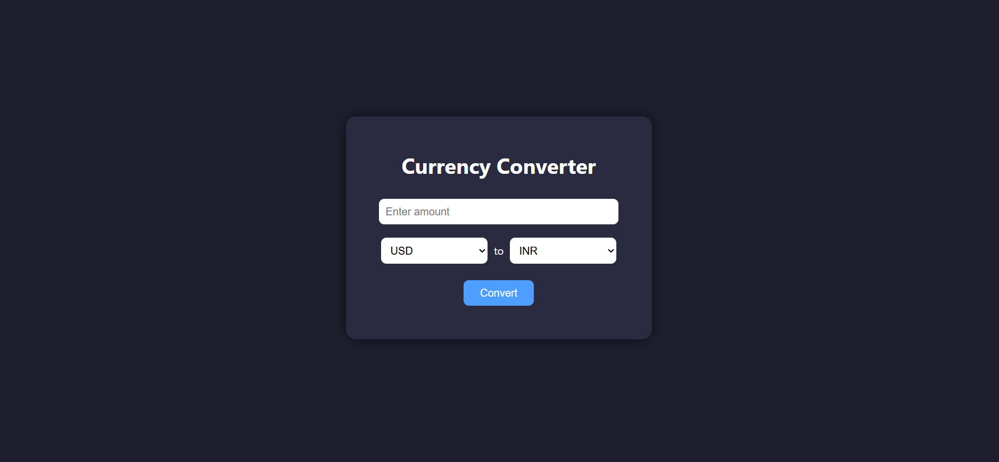

# 💱 Currency Converter

<p align="center">
  
</p>


A simple and responsive **Currency Converter** built using **HTML**, **CSS**, and **JavaScript** with a clean UI and dark theme support. This tool allows you to convert an entered amount from one currency to another instantly.

---

## 🌐 Live Demo

🔗 <a href="https://neerajkumar151.github.io/currency-calculator/">Try Now<a/>

---

## ✨ Features

- 🔢 Convert between **USD**, **EUR**, and **INR**
- 🌙 Dark-themed UI with stylish buttons and dropdowns
- 📱 Fully responsive for mobile and desktop
- 💡 Real-time calculation with a single click

---


## 🧑‍💻 Tech Stack

| Technology   | Description                  |
|--------------|------------------------------|
| HTML5        | Structure of the calculator  |
| CSS3         | Styling and layout           |
| JavaScript   | API integration & logic      |
| GitHub Pages | Deployment                   |

---

## 📂 Folder Structure

currency-calculator/
│
├── index.html # Main HTML file
├── style.css # CSS styling
├── script.js # JavaScript logic
├── assets/ # Images, icons, preview screenshot
│ └── preview.png # (Optional) Screenshot for README
└── README.md # Project documentation

---

## 🚀 How to Run Locally

1. **Clone the repository**  
```bash
git clone https://github.com/Neerajkumar151/currency-converter.git
```
2. **Open the project folder**
```bash
cd currency-calculator
```
3. **Open index.html in your web browser**
cd currency-converter

---

## 🌍 Deployment

This project is hosted on **GitHub Pages**  
🔗 [Click to Visit](https://neerajkumar151.github.io/currency-calculator/)

---

## 🔮 Future Plans

- Add historical exchange rate graph  
- Add currency flags and better UI/UX  
- Implement auto-suggestions for currency codes  
- Deploy a backend version with authentication & conversion history

---

## 🙋‍♂️ About Me

**Neeraj Kumar**  
🎓 Final Year B.Tech IT Student  
🏫 GL Bajaj Institute of Technology & Management, Greater Noida  
🌐 [GitHub Profile](https://github.com/Neerajkumar151)

---

## ⭐ Show Some Love

If you like this project:

- ⭐ Star the repo  
- 📌 Share it  
- 📥 Fork it  
- 💡 Contribute your ideas  

---

## 📄 License

This project is licensed under the [MIT License](https://opensource.org/licenses/MIT).

